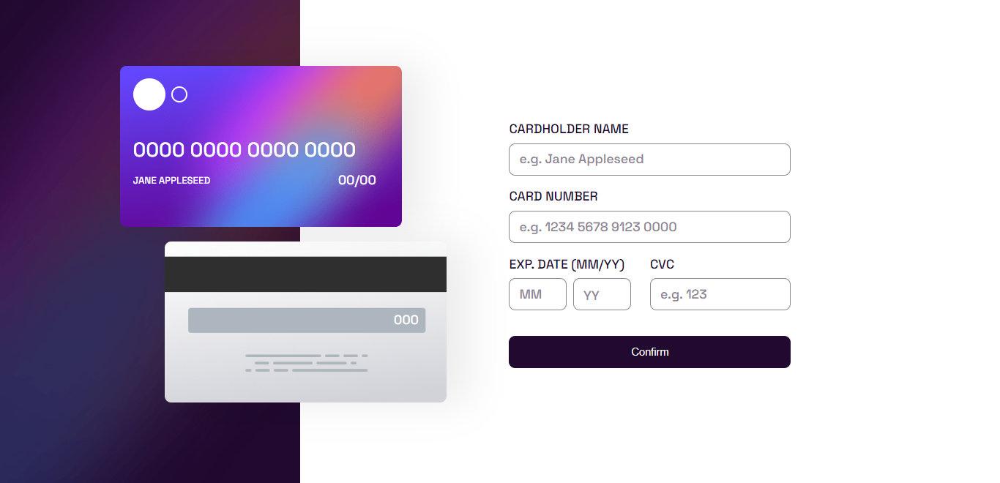

# Frontend Mentor - Interactive card details form solution

## Table of contents

- [Overview](#overview)
  - [The challenge](#the-challenge)
  - [Screenshot](#screenshot)
- [My process](#my-process)
  - [Built with](#built-with)
  - [What I learned](#what-i-learned)
  - [Continued development](#continued-development)
  - [Useful resources](#useful-resources)
- [Author](#author)

## Overview

### The challenge

Users should be able to:

- Fill in the form and see the card details update in real-time
- Receive error messages when the form is submitted if:
  - Any input field is empty
  - The card number, expiry date, or CVC fields are in the wrong format
- View the optimal layout depending on their device's screen size
- See hover, active, and focus states for interactive elements on the page

### Screenshot



## My process

### Built with

- Semantic HTML5 markup
- CSS custom properties
- Flexbox
- CSS Grid
- Mobile-first workflow

### What I learned

```css
.form__input:focus + div {
  inset-block-start: 1.8em;
  inset-inline-start: 0.9em;
  padding-inline: var(--pad-25);
  font-size: 1.2rem;
  z-index: 10;
  background-color: white;
  border-radius: var(--bdrs);
  transition: 0.3s;
}

.form__input:not(:placeholder-shown).form__input:not(:focus) + div {
  inset-block-start: 1.8em;
  inset-inline-start: 0.9em;
  padding-inline: var(--pad-25);
  font-size: 1.2rem;
  z-index: 10;
  border-radius: var(--bdrs);
  background-color: white;
}
```

```js
function formatNumber(value) {
  const regex = /^(\d{0,4})(\d{0,4})(\d{0,4})(\d{0,4})$/g;
  const onlyNumbers = value.replace(/[^\d]/g, "");

  return onlyNumbers.replace(regex, (regex, $1, $2, $3, $4) => {
    return [$1, $2, $3, $4].filter((group) => group).join(" ");
  });
}

/*
 ** css
 I was inspired by how google style their forms animation so i tried duplicating that.

 ** js
 The js was actually was from an article on stackoverflow. It restrict the user from entering any input other than numbers and group them into four numbers and with space in between.
 
 */
```

### Continued development

Regex, regex, regex. Regular expression is a powerful tool in any web developer arsenal and I think going forward, I will focus on regex, animation etc.

### Useful resources

- [Stack Overflow](https://stackoverflow.com/questions/36833366/format-credit-card-number) - A really useful article from stackoverflow on regex credit card validation.

## Author

- George Asiedu - [@george5-star](https://www.frontendmentor.io/profile/george5-star)
